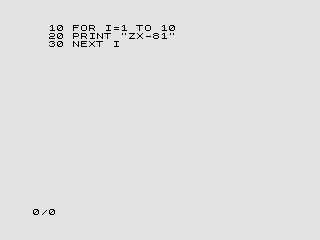
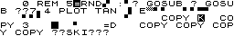
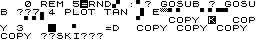

# AGEPLIST

Because of my recent interest in retro computer programming and just because it was fun, I wrote a C program that takes a P file and lists the BASIC program contained in it. It is good enough because it does not exactly reproduce the output of a real ZX81 when there is machine code in REM lines.

It works by loading the entire P file into memory (16375 bytes at most) and walking in it from the first BASIC line to the last, listing their contents. In a ZX81, the first line of a BASIC program starts at address 0x407d. Each line follows the following pattern:

1. One byte with the MSB of the line number.
1. One byte with the LSB of the line number.
1. One byte with the LSB of the line size.
1. One byte with the MSB of the line size.
1. At least one byte of line contents (the line commands.)
1. One byte 0x76 marking the end of the line.

After the first line, the second line starts, following exactly the same pattern, and this goes on until the last line, which is followed by one 0x76 byte. As an example, consider the program below:



This program is stored this way in memory:

|Address|Value|Description|
|-------|-----|-----------|
|0x407d|0x00|MSB of the line number of the first line|
|0x407e|0x0a|LSB of the line number of the first line (`0x00 << 8 | 0x0a = 10`)|
|0x407f|0x14|LSB of the size of the first line|
|0x4080|0x00|MSB of the size of the first line (`0x00 << 8 | 0x14 = 20`)|
|0x4081|0xeb|The `FOR` command|
|0x4082|0x2e|The `I` character|
|0x4083|0x14|The `=` character|
|0x4084|0x1d|The `1` character|
|0x4085|0x7e|The number marker (more on this later)|
|0x4086|0x81|The number 1 in ZX81's floating point notation|
|0x4087|0x00|"|
|0x4088|0x00|"|
|0x4089|0x00|"|
|0x408a|0x00|"|
|0x408b|0xdf|The `TO` keyword|
|0x408c|0x1d|The `1` character|
|0x408d|0x1c|The `0` character|
|0x408e|0x7e|The number marker (more on this later)|
|0x408f|0x84|The number 10 in ZX81's floating point notation|
|0x4090|0x20|"|
|0x4091|0x00|"|
|0x4092|0x00|"|
|0x4093|0x00|"|
|0x4094|0x76|The end of line|
|0x4095|0x00|MSB of the line number of the second line|
|0x4096|0x14|LSB of the line number of the second line (`0x00 << 8 | 0x14 = 20`)|
|0x4097|0x09|LSB of the size of the second line|
|0x4098|0x00|MSB of the size of the second line (`0x00 << 8 | 0x09 = 9`)|
|0x4099|0xf5|The `PRINT` command|
|0x409a|0x0b|The double quotes character|
|0x409b|0x3f|The `Z` character|
|0x409c|0x3d|The `X` character|
|0x409d|0x16|The `-` character|
|0x409e|0x24|The `8` character|
|0x409f|0x1d|The `1` character|
|0x40a0|0x0b|The double quotes character|
|0x40a1|0x76|The end of line|
|0x40a2|0x00|MSB of the line number of the third line|
|0x40a3|0x1e|LSB of the line number of the third line (`0x00 << 8 | 0x1e = 30`)|
|0x40a4|0x03|LSB of the size of the third line|
|0x40a5|0x00|MSB of the size of the third line (`0x00 << 8 | 0x03 = 3`)|
|0x40a6|0xf3|The `NEXT` command|
|0x40a7|0x2e|The `I` character|
|0x40a8|0x76|The end of line|
|0x40a9|0x76|The end of the program|

Remarks:

1. The line size is four bytes less than the actual line size.
1. Numbers in BASIC programs are stored twice, first as a sequence of characters and second as a floating point number. This is because floating point numbers in the ZX81 are very slow to decode and print, so when listing BASIC programs the character sequence is listed and the actual floating point value is skipped. If the character sequences doesn't exist, the listing would be very slow because each floating point number would have to be decoded to be printed in the listing.

With this information it seems easy to list a BASIC program: load the P file into memory and start at memory address `0x407d` (into the ZX81 memory space, not the host computer memory space.) Then:

1. Decode and print the line number.
1. Skip the line size.
1. Print every character until we find a `0x76`, skipping six bytes if a `0x7e` is found.
    If the next byte is not a `0x76`, restart from step 1.

But there are some gotchas:

1. Numbers in ZX81 listings are limited to four digits (9999), but line numbers up to 16383 are permitted. When a line number is greater than 9999, ZX81 lists them as A000 (for 10000), A001 (for 10001) up to G383 (16383.)
1. If a line number is greater then 16383, the listing stops even if more lines follow.
1. Machine code inside `REM` lines (very common) can contain the `0x76` byte in it. For example, if a REM line contains a `0x76` as its last byte, another 0x76 for the end of the line will follow and the ZX81 will think that the program ended.
1. Machine code can also contain the `0x7e` byte in it. If this byte is near the end of the line (less then six bytes), the `0x76` marking the end of the line can be skipped resulting in the two lines being listed as just one.

Gotchas 1 and 2 are easy to implement, and gotchas 3 and 4 are just a side effect of the lines being listed one byte after the other. So **AGEPLIST** gives a pretty good (perfect?) output for BASIC programs, and also gives options to show the `>` cursor on the current line, change the maximum number of columns to display, not stop on spurious program endings (`0x76 + 0x76`) and use a special True Type font to display the ZX81 character set in all its glory. **AGEPLIST**'s help screen is:

```
AGEPLIST - A Good Enough P LISTer program.
Copyright (C) 2010 Andre de Leiradella. Released under the GPL.

Usage: ageplist [-h] [-c] [-z] [-w width] [-s n] [-f] [-a] [-o output] input.p

-h    Show this help screen
-c    Show the current line cursor (toggle, default: no)
-z    Use the ZX-81.TTF font (toggle, default: no)
-w    Maximum number of character per line (default: 32)
-s    Set the first line to list (default: 0)
-f    Don't stop the listing on spurious program endings (toggle, default: no)
-a    Accurate (turns -c and -z on, -w to 32 and -f off (default: no)
-o    Output listing to file "output" (default: stdout)
```

And this is its output for the simple program:

```
 10 FOR I=1 TO 10
 20 PRINT "ZX-81"
 30 NEXT I
```

Just for completeness, here are two listings of a program called `DETECT.P` which comes in the EightyOne distribution:

|Real ZX81|AGEPLIST|
|---------|--------|
|||

Pretty good, probably good enough, but not identical.
