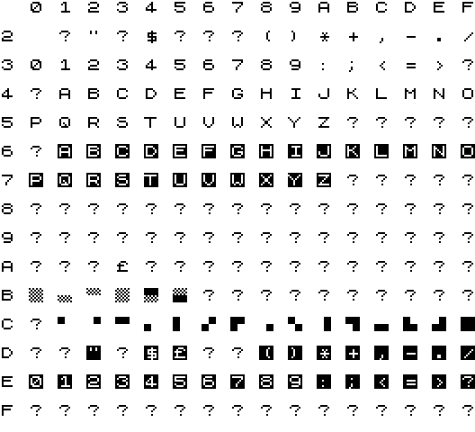

# ZX-81.ttf

When I made **AGEPLIST** and **WMAPLIST**, I wanted to be able to output characters using a ZX81 font to have a 100% faithful listing of the programs. I searched the Internet and found some fonts, but they were not perfect. Some didn't have all characters from the ZX81 character set, others would leave a gap between two lines which is very easy to notice when there are consecutive lines using graphic characters in the program.

So I decided to make my own ZX81 font. I downloaded FontForge and start drawing the first character. Then I realized how much that would take and how boring it would be. I thought that if I already had the bitmap of each character, I could generate a FontForge font in its native format and then use it just to generate the True Type font. While it wouldn't take less time than drawing the characters by hand, it would be much more fun.

Unfortunately the program was lost when a HDD without a backup broke. But I was able to find the font in one backup, so I'm putting it here for everyone to use. But someday I'll write that program again...

The character codes are in the table below:

Enjoy!
