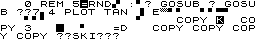
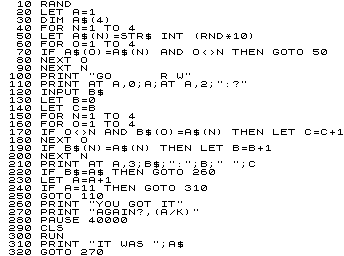

# WMAPLIST

In a attempt to make **AGEPLIST** perfect, I started to study a disassembly of the ZX81 ROM to learn how it lists programs. The objective was to write a C program that would do the exact same thing as the LIST routine in the ROM, but I quickly got lost in its complexity.

Then I had an idea. The best way to have a perfect listing of a ZX81 program is to list it in a ZX81! It's just a matter of opening the program in an emulator and listing it. But of course this is not practical:

1. The program is listed in the emulator's window and there's no easy way to get text from it, just screen shots.
1. The listing stops when the screen is full and you have to issue another LIST command to make it continue at the next line.
1. Most programs automatically start to run after being loaded and some can't be stopped so there's no easy way to list them.

To overcome these problems, I decided to write my own emulator. Yes, you read it right. It's not that difficult depending on what you want. Perfect emulation is of course very hard to achieve, but I don't need it. I don't need to emulate the TV output and the loading of tapes. But of course I didn't know exactly what I would need before starting to write the emulator.

The first thing I did was a research on Z80 emulators. I decided to use the Z80 emulator from Yet Another Z80 Emulator by AG (yaze-ag), version 2.20. While not perfect, it was easy enough to understand and use.

With the Z80 emulator in place, I took the ZX81 ROM from EightyOne and transformed in into a C array I could include in my program. Hex editors can be used to do this very easily. With a Z80 and a ROM, I was ready to "turn on" my emulator. Zero the program counter and let it run! Then, when the K prompt appears, I could issue commands to the ZX81 to load a program and list it. That's when I saw it would not be so easy. First problem was: how to know the K prompt appeared? Better yet, how to know the emulated ZX81 was ready to receive user input?

Then it came to me that I didn't need to emulate everything starting from powerup. I could make the emulation start anywhere I wanted by setting up the Z80 registers, the stack and some of the RAM. I started EightyOne and waited for the K prompt and then I paused it. In the debug window, I took note of all registers values, and I saved a RAM copy to disk. The register values were used to initialize my Z80 emulator, and the RAM copy was used to initialize my emulated RAM. So I could just issue key strokes to the emulator and make it execute anything I want.

So I started the emulation and I could see the K prompt by watching the emulated RAM. Now it's just a matter of simulating the key strokes. I went to the Internet and read about how the ZX81 keyboard works. And then another problem: the ZX81 uses an undocumented behavior of the IN and OUT instructions of the Z80 that the Z80 emulator from yaze-ag didn't emulate. While it would be easy to fix yaze-ag, I didn't want to start a yaze-ag branch. Besides, what would happen if I could send key strokes to the emulator? I would issue a `LOAD` command but there would be no K7 tape loading emulation.

I decided then to start my emulation at a different place. Instead of starting it at a point where the `K` prompt was ready to accept commands, I made it start at the very end of the execution of the LOAD command. I again used EightyOne to dump the registers and stack, but the rest of the RAM wasn't needed: all I had to do was to load the **P** program on top of whatever was in RAM. That's how LOAD works, it reads bytes from the K7, overwriting RAM from address `0x4009` until the end of the program. So after setting up registers, stack and loading the **P** program, my emulator would, well, execute the program! So I made a test and let the emulator run for a while, and when I took a look at the emulated RAM it was all ZEROES!

I thought about the problem for a moment and realized what I was doing wrong. The ZX81 generates the video output in a way that causes the Z80 to execute code at high RAM addresses, specifically at `(D_FILE) + 0x8000`. Since I wasn't emulating the video circuitry, the Z80 would run a series of `NOP`s until `0xffff`, where it would go back to address zero and reboot the emulation, and zeroing the RAM is part of the ZX81 boot process.

Since emulating the video circuitry requires far more integration with the Z80 emulator to make it work than what yaze-ag would let me, I decided to completely skip the video generation. I looked at the ZX81 ROM disassembly starting at address `0x0066`, the NMI interrupt service routine. I wanted to find the deepest routine that would execute the code at the higher RAM addresses, and it is the **DISPLAY-5** routine at address `0x02b5` in ROM. I replaced it with a `RET` instruction (`0xc9`) and then my emulator started behaving very well. I could load **P** programs and watch it execute by looking at the display file in the emulated RAM. Now there are just a few more problems to solve:

1. The **P** program starts to run automatically and I wanted to regain control over the emulation to list the program.
1. Once I had control over the emulation, how exactly would I list the program?

The solution to both problems was the `NXTLIN` (next line) system variable. This variable, which is loaded along with every **P** program, holds the address of the next BASIC line to be executed. When the `LOAD` ends, the BASIC interpreter looks at `NTXLIN` and resumes execution at that line. So I was able to set it just after the last line in the **P** program and the emulator would just present the `0/0` code at the bottom of the screen after the loading was done. But why stop there? I could use `NXTLIN` to make the emulator automatically execute a `LIST` command after the load so I wouldn't have to deal with the key strokes.

So I wrote a one-line BASIC program to list the loaded program. The program is just:

```
  1 LIST
```

And the hexadecimal dump of the program is:

|Address|Value|Description|
|-------|-----|-----------|
|0x403c|0x00|MSB of the line number of the first line|
|0x403d|0x01|LSB of the line number of the first line (`0x00 << 8 | 0x01 = 1`)|
|0x403e|0x02|LSB of the size of the first line|
|0x403f|0x00|MSB of the size of the first line (`0x00 << 8 | 0x02 = 2`)|
|0x4040|0xf0|The LIST command|
|0x4041|0x76|The end of line|
|0x4042|0x76|The end of the program|

Now it's just a matter of putting this somewhere in the emulated RAM and make `NXTLIN` point to it after the load. I though about high memory addresses, but I don't know how that memory is used in programs with more than 16 KiB. I know BASIC programs can never go beyond 0x7fff because of the display file, but you never know...

That was when another system variable comes in hand, `PRBUFF`. It's not really a variable, it's a buffer: the printer buffer. It has space to hold 33 bytes, more than enough for the one-liner. So I wrote the one-liner to `PRBUFF` and adjusted `NXTLIN` to point to it before emulation starts. When it starts, the program is listed in the display file. Yay!

But then another problem appeared (do they ever stop?) Even for very small programs, 22 lines in the display file aren't enough for a complete listing. And I wanted to have the option to list programs using more than 32 columns, a hard limit of the ZX81's display file. So back to the ZX81 ROM disassembly, this time to learn how characters are output to the screen. I found that two system variables take an important role in character output: the `DF_CC` and the `S_POSN`.

`DF_CC` holds the address of the next position in the display file. By adjusting this variable you can make the next character appear anywhere you want on the screen. So I could overwrite this variable to make it always point to the first character in the display file. But even then the LIST command would stop after some lines were listed. That's when `S_POSN` comes in hand.

`S_POSN` holds the number of lines left to be used in the display file, and the number of columns left in the current line (counting the new line at the end of the line, oddly.) So I could overwrite `S_POSN` to make the ZX81 think there were always space available in the line and in the screen so `LIST` would happily list the entire program in one go. And by watching it change I could even detect the end of the list of one line, before the next line was listed. The listing was finally working! I was really excited since I didn't know what the ZX81 would do having two BASIC programs in RAM, the **P** program we want to list in its regular place and the one-liner in the `PRBUFF`. But it worked like a charm.

Now the last problem (uff!): the emulator runs in a loop, executing one Z80 instruction per loop iteration. How would I know the listing was done so I could stop the emulation and exit the C program? The answer was quite simple actually. I changed the one-liner to the following two-liner:

```
  1 LIST
  2 STOP
```

And the hexadecimal dump of the program is:

|Address|Value|Description|
|-------|-----|-----------|
|0x403c|0x00|MSB of the line number of the first line|
|0x403d|0x01|LSB of the line number of the first line (`0x00 << 8 | 0x01 = 1`)|
|0x403e|0x02|LSB of the size of the first line|
|0x403f|0x00|MSB of the size of the first line (`0x00 << 8 | 0x02 = 2`)|
|0x4040|0xf0|The LIST command|
|0x4041|0x76|The end of line|
|0x4042|0x00|MSB of the line number of the second line|
|0x4042|0x76|The end of the program|
|0x4043|0x02|LSB of the line number of the second line (`0x00 << 8 | 0x02 = 2`)|
|0x4044|0x02|LSB of the size of the second line|
|0x4045|0x00|MSB of the size of the second line (`0x00 << 8 | 0x02 = 2`)|
|0x4046|0xe3|The STOP command|
|0x4047|0x76|The end of line|
|0x4048|0x76|The end of the program|

So I went back to the ROM disassembly and took note of the starting address of the `STOP` command, `0x0cdc`. I changed the program to stop the emulation when the program counter had that value and it worked. After the listing, the second line would execute the `STOP` command, the test would catch it and stop the emulation. World's Most Accurate **P** LISTer was ready!

Summarizing, those are the steps used in **WMAPLIST** to list a **P** program:

1. Create a 64 KiB buffer to be the emulated ROM and RAM.
1. Copy the ROM into the array at positions `0x0000` and `0x2000`.
1. Patch the `DISPLAY-5` routine by changing the buffer at positions `0x02b5` and `0x22b5` to a `RET` (`0xc9`)
1. Zero the rest of the buffer, from `0x4000` to `0xffff`.
1. Copy stack values to the stack.
1. Setup the Z80 registers.
1. Setup system variables from `0x4000` to `0x4008`.
1. Load **P** file into buffer starting at `0x4009`.
1. Put the two-liner into `PRBUFF`.
1. Make `NXTLIN` point to `PRBUFF`.
1. Begin the emulation, taking care of `DF_CC` and `S_POSN`, until Z80's program counter reaches `0x0cdc`.

And here are the listings of `DETECT.P`, from the ZX81 and from **WMAPLIST**:

|Real ZX81|**WMAPLIST**|
|---------|------------|
|||

Bellow a program from a magazine is listed (accurate mode with 72 columns):



Accurate enough? I think it is. But that being said, there's still one place where the listing won't be accurate: when there's a `0x7e` byte near the end of the BASIC program. That byte will jump the end of the program and the `LIST` command will happily start listing whatever comes next, and that would be the display file, causing some interesting effects in which it would repeat the listing, sometimes in an infinite loop. But since this would prevent the full program listing anyway, I'd say **WMAPLIST** is as accurate as it can be.
